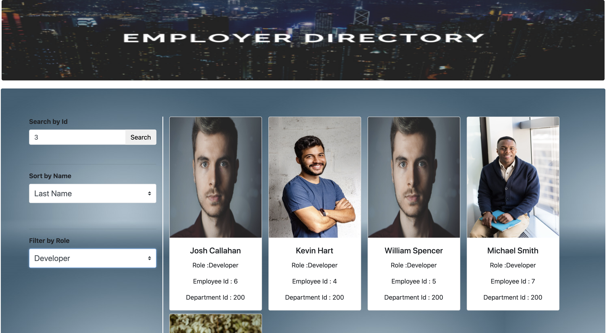

# EMPLOYEE-TRACKER
 

## Description
 

This is a simple application that allows Users to track the employees from a given comapany. Users will be able to see all employees, filter employees by Employee Id and by Role, Sort Employees by First Name and Last Name. Currently the application is using Data from a JSON file. So, in order to add a new Employee a new object needs to be added to the EmployeeList.json file, and will be automatically added to the list of employees displayed on the browser. Also, as we add new roles, they will also be added to the filter option automatically. The employees are being displayed by using Bootstrap Cards, as well as some of the CSS style on the pages. The whole application was built using React.

 

 

## Installation
 

The application can be forked or cloned from GITHUB. The app is launched in Heroku and can be opened by clicking <a href = "https://employertracker.herokuapp.com/"> here</a>. 

 

## Questions
 

Check out the app <a href = "https://employertracker.herokuapp.com/" target = "blank">here...</a> 
<a href = "mailto:gohucosta23@hotmail.com">gohucosta23@hotmail.com</a> 
